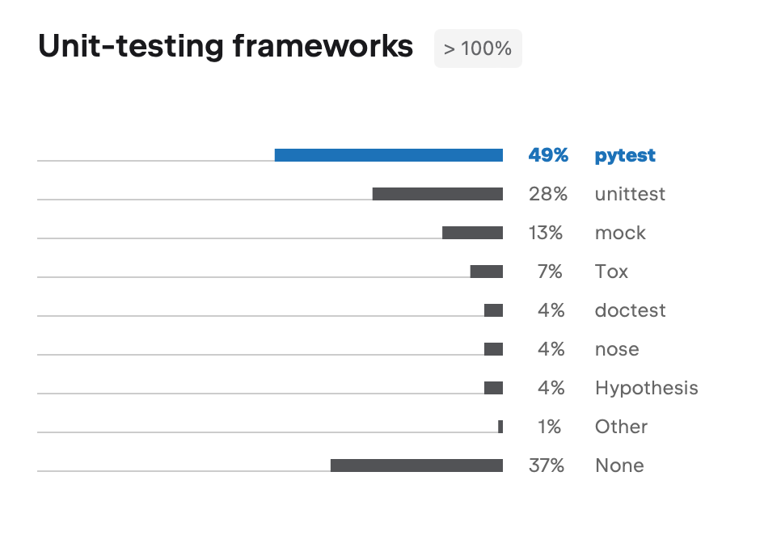
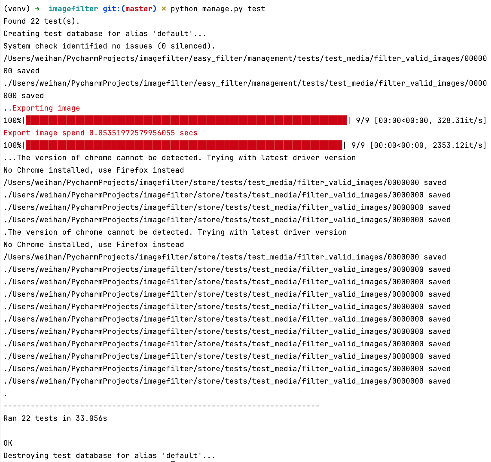

Chapter 8: 單元測試與重構
===

* 大綱
    * 簡介
        * 重構
        * 單元測試
    * 分享畫面
        * unittest用法
        * pytest簡單用法
        * 重構
        * 其他相關工具使用
    * 讀後心得
    * 隨時提問
* 重構
    * 什麼是重構
        * 不動外部
        * 只動內部
    * 目的
        * 容易理解
        * 改善架構
        * 開發效率
        * 性能
    * 前提
        * 單元測試
            * 敏捷開發/快速迭代
            * 工程師的安全網
            * 可靠
* 單元測試
    * 測試項目
        * Function
        * Method
        * 
    * 特性
        * 隔離
            * 不連資料庫
            * 不連http
            * 無前提/無狀態
                * enroll
                * verify
                    * Mock
            * 為什麼隔離
                * 自動化一環
                * Git PR
        * 效能
            * 快速
            * 多次
                * 每個PR
                * 大公司/大團隊
                    * 一天多次
            * 運算成本
                * GitHub
                    * 免費額度
                    * 小時制
        * 簡易運行
            * 無前置作業
            * 不用手冊
            * 自動運行
                * python -m unittest
                * Django
                    * python manage.py test
                    * 
* 工具
    * 類型
        * 測試
        * 覆蓋率
        * 突變測試
    * 測試
        * 熱門選擇
            * Unittest
            * Pytest
        * unittest
            * 內建
        * pytest
            * 簡潔
            * 更多錯誤細節
        * 直接看分享畫面IDE操作
            * Unittest/pytest 簡單比較
            * Unittest
                * 基礎用法
                * 反向案例 / handle error
                * 重構範例
                    * 專注status
                * Fixture
                    * 同一function
                    * 不同測試案例
                    * 用subTest
                * Mock
                    * 隔離
                    * 外部API
                    * 重構
    * 測試覆蓋率
        * coverage
            * For unittest
        * pytest-cov
            * For pytest
    * 突變測試
        * mutpy
        * 測試的測試
        * 故意將原始程式改錯
* TDD
    * Test-driven development
    * 測試驅動開發
* 現況
    * 測試
        * 實際需要連接API
        * 實際虛連接資料庫
    * 後台
        * 無法簡單統計覆蓋率
        * 畫面非function/method
    * Django
        * 框架完整/開發習慣
        * 導致function邏輯簡單
    * POC
        * 規格一直改
        * 開發時間短
        * 並非長期產品
        * 追求彈性

